<!-- This public repository is intentionally named `jkznx` so GitHub renders it on the profile. -->

  

  
   
  
  

## `~/tech-stack`

  
  
  
  
  
  
  
  

| Area | Tools and practice |
| --- | --- |
| AI Ecosystem Workspace | FastAPI, Pydantic, SQLAlchemy, arq workers, PostgreSQL, Redis, MinIO, Label Studio, Uvicorn, Docker Compose |
| Systems and cloud | Linux, Docker, Kubernetes, Git, Google Cloud, Alibaba Cloud, deployment workflows |
| Networks and defence | Cisco Packet Tracer, Cisco Catalyst, Cisco Prime, Wireshark, Xshell, TCP/IP, Wazuh, Suricata, SIEM monitoring, incident response |
| Software and data | Python, C/C++, Assembly, SQL, HTML, CSS, JavaScript, React, machine learning |
| Computer vision and ML | CVAT data annotation, Label Studio, Hugging Face, model experimentation, dataset workflows |
| Embedded systems | ESP32, Arduino Uno, ODROID, sensor-connected prototypes |
| AI-assisted workflow | Codex, Claude, Warp, Antigravity, GitHub Copilot |

## `~/experience`

| Role | What I did |
| --- | --- |
| System Engineer · Anyware Communication Co., Ltd. | Deployed and supported network devices and servers; reduced downtime through practical troubleshooting; prepared diagrams and operational handover documents. |
| Cybersecurity Intern · DiiS PSU | Monitored SIEM events, investigated and escalated potential incidents, and built clear security runbooks and checklists. |
| Competitor · Thailand Cyber Top Talent 2025 | Placed 6th nationally as part of a blue team across penetration-testing, capture-the-flag, and incident-response challenges. |
| President · International Relations Club, PSU | Led student activities, workshops, and international collaboration. |

## `~/selected-builds`

| Build | Focus | Repository |
| --- | --- | --- |
| AI Ecosystem Workspace | AI platform with FastAPI, background workers, PostgreSQL, Redis, MinIO, Label Studio, and Docker Compose | [Open project](https://github.com/jkznx/ai-ecosystem-workspace) |
| CoE Lotto | Cloud deployment and Kubernetes | [Open project](https://github.com/jkznx/sda_final) |
| Network Infrastructure | Enterprise networking with Wazuh and Suricata | [Explore coursework](https://github.com/jkznx/My-Project-in-University/tree/main/Year_3/semester_2) |
| Pick and Pay | Cashierless embedded minimart prototype | [Explore coursework](https://github.com/jkznx/My-Project-in-University/tree/main/Year_3/semester_1) |
| URL Malware Classification | Applied machine-learning classification | [Explore coursework](https://github.com/jkznx/My-Project-in-University/tree/main/Year_3/semester_1) |

## `~/signals`

  
  

  

## `~/find-me`

  
  
  

Reliable systems. Calm under pressure.

